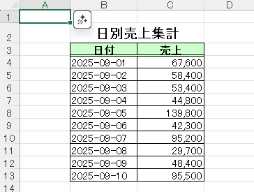
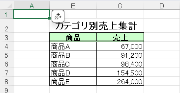

# CSV 自動集計ツール

このツールは、CSV データを自動的に読み込み、  
「日別商品数量集計」「日別売上集計」「カテゴリ別売上集計」を  
1つの Excel ファイルにシート分けして出力する Python スクリプトです。  

表はタイトル・ヘッダー装飾・セル幅調整済みで、ビジネスでもすぐに利用できる見やすいレイアウトになります。

---

## 機能

- CSV ファイルを読み込み、自動で集計  
- **日別 × 商品ごとの数量** をクロス集計  
- **日別の売上合計** を算出  
- **商品カテゴリごとの売上合計** を算出  
- 出力は 1つの Excel ファイル（`report.xlsx`）にシート分け  
- タイトルは中央寄せ、ヘッダーは色付き・下二重線、表全体に罫線  
- タイトルが見切れないように自動調整済み  

---

## 必要な環境

- Python 3.9 以上推奨  
- Windows / macOS / Linux 対応  

---

## インストール方法

1. リポジトリをクローン  

    ```bash
    git clone https://github.com/ユーザー名/csv_auto_tools.git
    cd csv_auto_tools
    ```

2. 仮想環境を作成して有効化  

    **Windows の場合**  

    ```bash
    python -m venv venv
    venv\Scripts\activate
    ```

    **macOS / Linux の場合**  

    ```bash
    python -m venv venv
    source venv/bin/activate
    ```

3. 必要なライブラリをインストール  

    ```bash
    pip install -r requirements.txt
    ```

---

## 使用方法

1. `examples/` フォルダに CSV ファイルを配置  
   - 例: `sample_data_1.csv`, `sample_data_2.csv`  

2. スクリプトを実行  

    ```bash
    python csv_auto.py
    ```

3. 出力結果  

   - `output/report.xlsx` に以下のシートが生成されます  
     - **日別商品数量集計**  
     - **日別売上集計**  
     - **カテゴリ別売上集計**  

---

## 出力例（スクリーンショット）

### 日別商品数量集計


### 日別売上集計


### カテゴリ別売上集計


---

## フォルダ構成

<pre><code>
csv_auto_tools/
├─ csv_auto.py               # メインスクリプト
├─ README.md                 # このファイル
├─ requirements.txt          # 依存ライブラリ
├─ .gitignore                # Git 無視設定
├─ examples/                 # サンプル CSV
│   ├─ sample_data_1.csv
│   └─ sample_data_2.csv
└─ docs/
    └─ screenshots/          # 出力例スクリーンショット
        ├─ daily_product_count.png
        ├─ daily_total.png
        └─ category_total.png
</code></pre>

---

## ライセンス

MIT License
